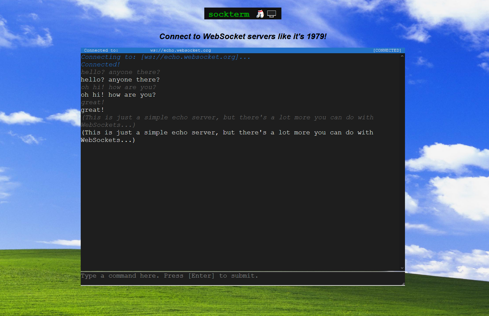

# sockterm 🧦🖥
A flexible, easy-to-embed terminal emulator for connecting to WebSockets.



## Getting Started
To see a few examples of using `sockterm`, check out the [examples folder](./examples/).

`sockterm` comes in two flavors. 
`sockterm-element.js` creates a custom HTML element.
You can use it like so:
```html
<!DOCTYPE html>
<html lang="en">
<head>
  <meta charset="utf-8">
  <!--Load the latest version of sockterm-element"-->
  <script src="release/sockterm-element.min.js"></script>
</head>
<body>
  <!-- Now create a sockterm element. That was easy! -->
  <sockterm></sockterm>
</body>
</html>
```
Note that this may not work on Safari or Opera.

For a bit more control, you can use `sockterm.js`.
`sockterm.js` requires that you initialize the Elm app and ports yourself.
Moreover, you ***must*** load the pre-defined CSS to get the colorscheme correct.
`sockterm.js` won't look or work right without some good CSS!
```html
<!DOCTYPE html>
<html lang="en">
<head>
  <meta charset="utf-8">
  <!-- Load the sockterm.js library from jsdelivr -->
  <script src="https://cdn.jsdelivr.net/gh/wsowens/sockterm@1.0.2/dist/sockterm-element.min.js" type="application/javascript"></script>
  <!-- Load the required CSS. -->
  <link rel="stylesheet" href="https://cdn.jsdelivr.net/gh/wsowens/sockterm@1.0.2/dist/sockterm.min.css">
</head>
</head>
<body>
  <div id="my-term"></div>
  <script>
  // create a new Elm app instance
  var app = Elm.Main.init({
      node: document.getElementById("my-term"); // take over the div above
  })
  // create the websocket and initialize the ports
  initializeSocketPorts(app);
  </script>
</body>
</html>
```

The beauty of this approach is that you can define your own colorscheme, if you so choose. See
the [colorscheme example](./examples/colorscheme.html) for more details.

## Compiling from Source
This project requires the Elm compiler.
You can find installation instructions in the [Elm Guide](https://guide.elm-lang.org/install/elm.html).

Our `makefile` uses `uglifyjs-es` to minify the Javascript.
(The code for the custom element uses some ECMAScript syntax.)
If you want to use these features, you can install [uglify-es](https://www.npmjs.com/package/uglify-es) as a command line app:
```sh
npm install uglify-es -g
```

To compile the basic `sockterm.js` and `sockterm-element.js` scripts, you can simply run `make sockterm.js`.
(If you don't have `make` on your system, you can simply copy the commands from the [makefile](./makefile))
The compiled scripts will be placed in `./build/`.

If you have `uglify-js` installed, you can minify the code by running `make minified`.
The minified scripts will be placed in `./build/min/`.

## About
This library makes heavy use of `Elm`, the delightful functional programming langauge.
All of the HTML rendering, ANSI escape code parsing, user input handling happens in Elm.
Check out [term package](https://github.com/wsowens/term.git) for more details on how this was implemented.

Unfortunately, Elm packages cannot interact with WebSockets without the use of Ports and a bit of boilerplate JavaScript.
This repo includes a simple Elm application based on the `term` package, with all the proper ports and boilerplate code.
This all compiles down to a simple JavaScript file. (About 16KB once minified and gzipped!)

## License
This project is licensed under the Apache 2.0 License. See the [license](./LICENSE) for details.